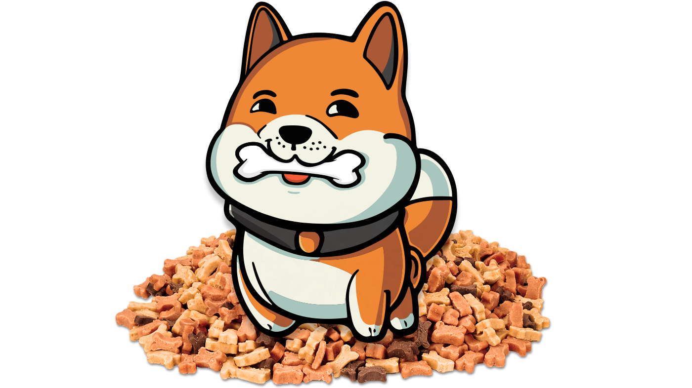

---
layout:
  title:
    visible: true
  description:
    visible: true
  tableOfContents:
    visible: true
  outline:
    visible: true
  pagination:
    visible: true
---

# ℹ ChewySwap Intro

<figure><figcaption></figcaption></figure>


ChewySwap helps you make the most out of your Shibarium and Dogechain trading experience in multiple ways: Track, Trade, Earn and Community! A unique DEX combining portfolio tracking, NFT's, Staking, Farms and more!


**Quick Links:** [Smart Contracts](broken-reference) | [MasterChef](broken-reference)

## Trade

> Instantly swap crypto tokens on Shibarium & Dogechain in a Decentralized way: No registration or account needed.

### By the People, For the People!

ChewySwap is the leading _**Community-Based**_ decentralized exchange on Shibarium and Dogechain, the two leading EVM compatible blockchains for Dog lovers! For more information on Shiba Inu and Shibarium [Click Here!](https://shib.io) For more information on Dogechain and the charge to bring Decentralized Finance and increased utility to Dogecoin [Click Here!](https://dogechain.dog)

### For the Public Good!

ChewySwap is pledging 2% of all profits generated from platform trading fees to charities helping Children and Dogs. The target recipient of these funds will be voted on by on-chain Governance using CHEWY tokens.

### Low, Near-Zero Fees!

If you thought BSC had low fees wait til you start trading on Shibarium! The cost for a swap on ChewySwap is fractions of a Bone making trading an easy and fast process. Even when BONE goes to hundreds of dollars those fees will still only be pennies which is much lower than BSC and _**miles**_ lower than Ethereum!

## &#x20;Earn

> Earn CHEWY and other tokens for free with interest rates that will leave you and your furry friend salivating!

### Earn tokens with Single Staking (Coming Soon)

Stake a variety of Shibarium-based tokens and earn free tokens. Third party pools provided to projects feed back into our ecosystem making for more sustainable rewards helping Chewy retain its value so you can earn more, for even longer.

### Earn CHEWY with Yield Farms

Stake LP tokens, earn CHEWY. You take on a little more exposure to market fluctuations than with single token staking pools, but you can earn higher APR to offset the risk

### Earn Trading Fees

No farm? No problem! Even if your trading pair isn't supported on the Farms page, you can still earn trading fees when you stake your tokens in Liquidity Pools (LPs).

## Is ChewySwap Safe?

### Transparent:

* We're built on open-source software: our site and all our Smart Contracts are publicly visible for maximum transparency.
* Our contracts are verified on ShibariumScan so you know that what you see is what you get: (coming soon)
* All frontend code is Open Source and can be accessed via [GitHub](https://github.com/PooDoge/DogeshrekDEX-UI) (coming soon)
* Unlike many DEX on Shibarium, we're fully GPL v3 compliant and share every bit of forked code completely up to date

### Always Accessible

* Our frontends all have IPFS backups so no matter what happens to our web host you'll always have access to your funds
* We have a team of moderators ready to answer any of your questions and to give customer support nearly 24/7 in our [Telegram Group](https://t.me/chewyswapcommunity).

### Safe, Experienced Team

* Lead Developer is a Crypto OG - got started mining crypto in 2014 and has been known to help revive multiple dead, abandoned or rugged projects. He is always quick to help users with their blockchain woes and never turns down a request for help. ChewySwap is meant to embody the positive feel-good attitude of a community that comes together for the public good!
* Team includes a group of friends who went through the last bull-bear market cycle together and are motivated to make a lasting impact in the space by being the most active and transparent team ever seen in DeFi

### Safe, Audited Smart Contracts

Especially when you're dealing with new projects on new blockchains it's important that every step be taken to ensure that user's funds are safe from exploitation by hackers or even by bad actors on a project's team. A decentralized exchange shouldn't be able to be exploited by hackers or rugged by its owners, for this reason we chose to fork only the most tried and tested smart contracts for our DEX from the likes of Uniswap and PancakeSwap.&#x20;

To be sure that we didn't miss anything before launching ChewySwap to the public we got all our smart contracts audited by a reputable 3rd party. There were thankfully no major security issues and we received a clean score, you can check the auditor's findings at the link below:


[audits.md](chewyswap-intro/audits.md)

