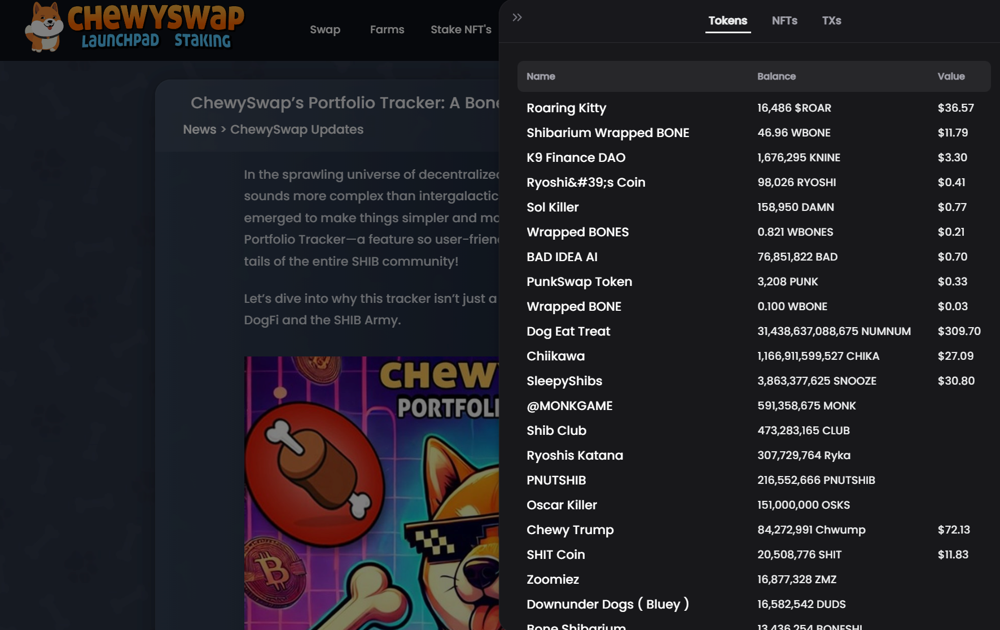

---
layout:
  title:
    visible: true
  description:
    visible: true
  tableOfContents:
    visible: true
  outline:
    visible: true
  pagination:
    visible: true
---

# ℹ️ ChewySwap Intro


[ChewySwap](https://chewyswap.dog), now live on Shibarium and Dogechain! Helps you make the most out of your Doggy Blockchain trading experience by making it easy to Track, Trade and Earn while interacting with the most active and inviting communities in all of crypto! A unique DEX combining the power of NFT's, Staking, Farming and more! ChewySwap is meant to be powerful enough for the avid DeFi trader while being easy enough to use for all Shibes making their first foray into DeFi!


**Quick Links:** [Smart Contracts](broken-reference) | [MasterChef](broken-reference)

<figure><figcaption></figcaption></figure>

## Trade

> Instantly swap crypto tokens on Shibarium & Dogechain in a Decentralized way: No registration or account needed.

## By the People, For the People!

ChewySwap is the leading _**Community-Based**_ decentralized exchange on Shibarium and Dogechain, the two leading EVM compatible blockchains for Dog lovers! For more information on Shiba Inu and Shibarium [Click Here!](https://shib.io) For more information on Dogechain and the charge to bring Decentralized Finance and increased utility to Dogecoin [Click Here!](https://dogechain.dog)

## For the Public Good!

ChewySwap is pledging half of all profits¹ generated from platform fees to charitable causes that are important to members of our community! In an industry where short term profiteering normally takes priority, we take an entirely different approach. By focusing on using our skills to help enrich others and little by little making the world a better place we hope to continue attracting likeminded individuals who reflect the values and principles on which Chewy was founded!\
\
We've already made a couple contributions to various charities such as the [Good Dog Foundation](https://twitter.com/ChewySwap/status/1770783799514689808), [American Cancer Society](https://twitter.com/ChewySwap/status/1771192900388323417) and [Guiding Eyes for the Blind](https://twitter.com/ChewySwap/status/1773430909758234958) - all foundations that were suggested by members of our beloved community. Stay tuned on our [Twitter page ](https://twitter.com/ChewySwap)to keep up to date on our latest donations and also be sure to let us know in the comments what charity or cause is most important to you and we'll get them on the next donation!\
&#x20;\
¹ Profits being equal to funds generated from DEX Platform Fees - Platform Overhead

## Staying on the Cutting Edge

ChewySwap is about more than building an amazing decentralized exchange, we work closely with builders using our expertise to help foster growth and innovation in the growing field of MemeFi. It's about more than keeping up with the latest trends but also the latest technology - our DEX is armed with the latest Web3 tech enabling the use of nearly any consumer wallet app including support for [Multi-Signature wallets](https://wallet.cryptiq.online) enabling improved trust and security.

<figure><figcaption></figcaption></figure>

## Low, Near-Zero Fees!

If you thought BSC had low fees wait until you start trading on Shibarium and Dogechain! The cost for a swap on ChewySwap is fractions of a Bone / Doge making trading an easy and fast process. Even when BONE / Doge go to hundreds of dollars those fees will still only be pennies which is much lower than BSC and _**miles**_ lower than Ethereum!

## &#x20;Earn

> Earn CHEWY and other tokens for free with interest rates that will leave you and your furry friend salivating!

## Earn tokens with Single Staking

Stake a variety of Shibarium-based tokens and earn free tokens. And also coming soon: Third party pools provided to projects feed back into our ecosystem making for more sustainable rewards helping Chewy retain its value so you can earn more, for even longer.

## Earn CHEWY with Yield Farms

Stake LP tokens, earn CHEWY. You take on a little more exposure to market fluctuations than with single token staking pools, but you can earn higher APR to offset the risk

## Earn Trading Fees

No farm? No problem! Even if your trading pair isn't supported on the Farms page, you can still earn trading fees when you stake your tokens in Liquidity Pools (LPs).

## Is ChewySwap Safe?

### Team KYC'd

KYC by [Assure Defi](https://assuredefi.com/projects/chewyswap/) to ensure safety and accountability! Two team members have been through a rigorous KYC process by Assure, including the wallets that hold all project funds.&#x20;

<figure><figcaption>
<a href="https://assuredefi.com/projects/chewyswap/">ChewySwap KYC Verified by Assure DeFi</a>
</figcaption></figure>

### Transparent:

* We're built on open-source software: our site and all our Smart Contracts are publicly visible for maximum transparency.
* Our contracts are verified on ShibariumScan so you know that what you see is what you get: (coming soon)
* All frontend code is Open Source and can be accessed via [GitHub](https://github.com/PooDoge/DogeshrekDEX-UI) (coming soon)
* Unlike many DEX on Shibarium, we're fully GPL v3 compliant and share every bit of forked code completely up to date (Updated GitHub coming soon)

### Always Accessible

* Our frontends all have IPFS backups so no matter what happens to our web host you'll always have access to your funds
* We have a team of moderators ready to answer any of your questions and to give customer support nearly 24/7 in our [Telegram Group](https://t.me/chewyswapcommunity).

### Experienced Team

* Lead Developer is a Crypto OG - got started mining crypto in 2014 and has been known to help revive multiple dead, abandoned or rugged projects. He is always quick to help users with their blockchain woes and never turns down a request for help. ChewySwap is meant to embody the positive feel-good attitude of a community that comes together for the public good!
* Team includes a group of friends who went through the last bull-bear market cycle together and are motivated to make a lasting impact in the space by being the most active and transparent team ever seen in DeFi

### Audited Smart Contracts

Especially when you're dealing with new projects on new blockchains it's important that every step be taken to ensure that user's funds are safe from exploitation by hackers or even by bad actors on a project's team. A decentralized exchange shouldn't be able to be exploited by hackers or rugged by its owners, for this reason we chose to fork only the most tried and tested smart contracts for our DEX from the likes of Uniswap and PancakeSwap.&#x20;

To be sure that we didn't miss anything before launching ChewySwap to the public we got all our smart contracts audited by a reputable 3rd party. There were thankfully no major security issues and we received a clean score, you can check the auditor's findings at the link below:


[audits.md](chewyswap-intro/audits.md)

