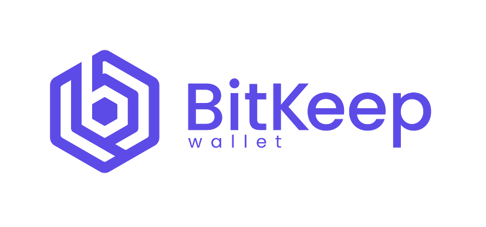
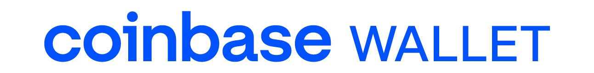
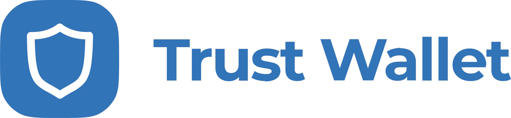

# 👜 Create a Wallet

To get started on ChewySwap, the first thing you'll need is to set up a wallet that supports Shibarium or custom EVM chains. Wallets are available both on desktop computers and on smartphone devices. You'll need to choose the wallet that fits your needs best.


**When you're setting up a wallet, be sure to:**

* :white\_check\_mark: **Download and install only the latest version from an official source.**
* :white\_check\_mark:  **Follow the setup guide carefully**
* :white\_check\_mark: **Safely back up your recovery phrases.**
* :no\_entry: **NEVER share your recovery phrases with anyone, under any circumstances.**
* :no\_entry: **EVER input your recovery phrase to a website or app, other than your wallet app.**


## Smartphone/Mobile or Desktop wallet?

Mobile device wallets and desktop-based wallets have different strengths and weaknesses. Consider which fits your needs better to help decide which type of wallet to use.

<table><thead><tr><th width="332.3333333333333">Feature</th><th width="211">Mobile</th><th>Desktop</th></tr></thead><tbody><tr><td>Use anywhere</td><td>✅</td><td>❌</td></tr><tr><td>Easy to use</td><td>✅</td><td>❌</td></tr><tr><td>More secure</td><td>❌</td><td>✅</td></tr><tr><td>Accessibility friendly</td><td>❌</td><td>✅</td></tr><tr><td>Damage/loss/theft resistant</td><td>❌</td><td>✅</td></tr><tr><td>Power/connection outage resistant</td><td>✅</td><td>❌</td></tr></tbody></table>

### Smartphone/Mobile wallets

Smartphone/Mobile wallets allow you to access your crypto almost anywhere. Wallets are available on both Android and iOS devices.

### Which wallet should I choose?

Here's a list of the most popular wallets you can use to connect to Shibarium and trade on ChewySwap:



<figure><figcaption></figcaption></figure>

Metamask is one of the oldest open-source software wallets that supports Shibarium. It has a built-in dApp browser on most platforms and is compatible with all EVM-compatible blockchains. A bit of a learning curve for newbies but it's the most tried and tested wallet in the industry. There are constant security updates with new features and UI upgrades being added all the time. Users have to manually add Shibarium's network info as there are only a couple built-in blockchain networks. Also supports walletconnect and hardware wallets such as trezor.

**Supported Platforms:** PC (Browser Extension), iOS and Android

[**Download MetaMask**](https://metamask.io/download.html) (Automatically detects device)\
[**MetaMask Setup Guide**](https://academy.binance.com/en/articles/connecting-metamask-to-binance-smart-chain)



<figure><figcaption></figcaption></figure>

Bitkeep wallet is a relatively new kid on the block as far as software wallets, it is a great choice for beginners because it supports custom EVM networks like Shibarium. It's open source and has support for many other networks such as Dogecoin, Ethereum, BSC, Polkadot, Solana and more. It has a built in NFT marketplace and modern dapp browser. In my testing is compatible with most dApps that are compatible with Metamask\
\
**Supported Platforms:** PC (Browser Extension), iOS and Android

[**Download BitKeep Wallet**](https://bitkeep.com/en/download) (Automatically Detects Device)

[**BitKeep Getting Started Guide**](https://study.bitkeep.com/en/?ht\_kb=create-your-first-wallet)



<figure><figcaption></figcaption></figure>

Millions of users choose Coinbase Wallet to earn yield with DeFi, swap more than 5,500 assets, and hold their NFT collections. Coinbase wallet supports BEP2 & BEP20 (Binance Chain and BNB Smart Chain networks).

**Highlights:**

* Most downloaded mobile dapp wallet in the United States with 12M+ active Wallet users.
* No additional steps needed to use with BNB Smart Chain and PancakeSwap.
* Premier audience: Up to 89M+ Coinbase retail app users to onboard to Coinbase Wallet as they start to explore web3.
* Easy to transfer assets from Coinbase retail app.
* Fiat On-ramp: Users can now directly purchase crypto with fiat in all 86 countries where Coinbase operates, without leaving Wallet.
* Industry leading security with secure cloud backup.

[**Download Coinbase Wallet**](https://coinbase-wallet.onelink.me/q5Sx/fdb9b250) **(Automatically detects device)**

[**Coinbase Wallet Setup Guide**](https://www.coinbase.com/wallet/getting-started-mobile)

_Coinbase Wallet is a self-custody wallet providing software services subject to Coinbase Wallet_ [_Terms of Service_](https://wallet.coinbase.com/terms-of-service) _and_ [_Privacy Policy_](https://wallet.coinbase.com/privacy-policy)_. Coinbase Wallet is_ [_distinct_](https://help.coinbase.com/en/wallet/getting-started/what-s-the-difference-between-coinbase-com-and-wallet) _from Coinbase.com, and private keys for Coinbase Wallet are stored directly by the user and not by Coinbase. Fees may apply. You do not need a Coinbase.com account to use Coinbase Wallet._



<figure><figcaption></figcaption></figure>

Trust Wallet is a community driven, open-source, multi coin crypto wallet. It enables blockchain developers to build their DApps and wallets natively without having to worry about the low-level implementation details. It doesn't have as good compatibility with 3rd party dApps as other options but the good news is that if you use TrustWallet it's possible to add Dogechain now as a custom network!

[**How to Add a Custom Network**](https://community.trustwallet.com/t/how-to-add-a-custom-network-on-the-trust-wallet-mobile-app/626781) (To TrustWallet)

[**Dogechain Network Information**](https://docs.dogechain.dog/docs/overview)



<figure><figcaption></figcaption></figure>

Coin98 wallet is a closed source software wallet application, for this reason we would not recommend using it although it does support adding Dogechain as a custom network. However if you're already using C98 wallet and don't mind that it's not completely open source then it will work fine for using with Dogechain\

[**How to Add Custom Network**](https://docs.coin98.com/products/coin98-super-app/extension/beginners-guide/add-custom-networks) (With C98 Wallet)

[**Dogechain Network Information**](https://docs.dogechain.dog/docs/overview) (Use to Connect C98 to Dogechain)




**NEVER**, in any situation, should you ever give someone your private key or recovery phrase ("seed phrase"). This will give someone complete access to your crypto!

The genuine ChewySwap site and staff will never ask you to input your seed phrase.

