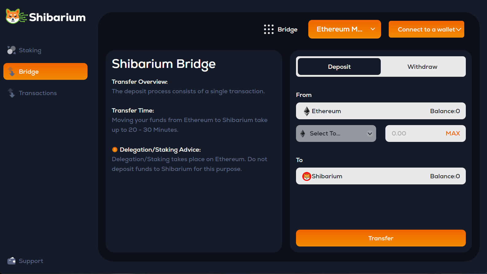

# 🍖 Get BONE for Gas

The native tokens of Shibarium use the **ERC-20** token standard (Ethereum standard tokens implemented in [Ethereum mainnet EIP-20](https://eips.ethereum.org/EIPS/eip-20)).

To do most things on Shibarium you will need to pay gas which comes in the form of BONE. BONE is like the ETH, BNB or AVAX of Shibarium. In order to get the gas tokens needed to trade on Shibarium you'll need to bridge BONE from Ethereum to Shibarium using the official bridge.&#x20;


The Shibarium Bridge also supports bridging of Wrapped Ether to Shibarium mainnet, but in order to make any swaps or transactions you'll still need to bridge some BONE tokens to Shibarium!


This early into Shibarium's release there's only one way to bridge Bone from Ethereum to Shibarium, and that's to use the official [Bridge located here](https://shibarium.shib.io/bridge).



<figure><figcaption>
Shibarium Native Bridge
</figcaption></figure>

[Shibarium Bridge](https://shibarium.shib.io/bridge) - official cross-chain bridge for bridging BONE and Wrapped ETHER between Ethereum and Shibarium.

This bridge will allow you to move your Bone/ETH seamlessly between Shibarium and Ethereum, to participate in the growing Dog-Fi ecosystem!

📺 [How to use Shibarium Bridge (Video)](https://www.youtube.com/watch?v=LxGTN-q6zSY)



\*\* There's currently not any legitimate alternatives to the official Shibarium bridge for bridging between Ethereum and Shibarium.



