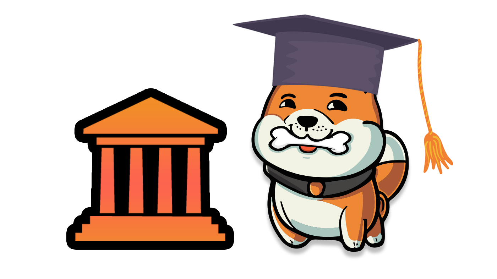

# ⚖ Governance and Tokenomics

<figure><figcaption></figcaption></figure>

## Token Holder Governance

Keeping in line with Ryoshi's vision, ChewySwap is a Decentralized Exchange built by the people and for the people! In the spirit of this we have built ChewySwap with everything needed to transfer control of the Exchange to On-chain Governance!

Being so early on in Shibarium and Chewy token's life, right now is a time where we need to stay flexible in order to adapt to changing market conditions and sentiment. When it comes to governance you sacrifice flexibility in exchange for safety and community control. When the supply of Chewy token is adequately decentralized spread amongst many different holders then that's the time where we would benefit most from transferring ownership of the DEX contracts to Governance + Timelock.

## What is Governance?

On-chain governance is the ability of token holders to vote on proposals set forth by those who hold a minimum amount of voting power (to prevent spam). When a proposal is made voting takes place over a predefined voting period determined by the DAO protocol. In order for holders to be able to vote they must first submit a delegate transaction before their tokens can be included in governance votes. Users may either delegate to a third party or to themselves if they would like to participate in voting directly. Optionally a proposal delay may be set in order to delay the start of the vote for a specified period allowing users time to update their vote delegation.

When the voting period ends the system checks if the number of yes votes exceed the protocol's quorum threshold. For example Compound requires 4% of total tokens to vote in support to meet quorum. If the quorum threshold has been met and the vote gains majority support, the passed proposal is then placed into a timelock queue which delays code execution. Timelock is intended as a security measure, allowing users to withdraw their funds if they think the proposal is malicious.

## Benefits of Governance DAO

The main benefit of using Governance DAO contracts is simply trust. When a protocol grows to reach the size where millions of dollars are at risk if the administrator of DEX contracts' account gets hacked or they decide to rug the holders, having smart contract functions behind a Timelock and Governor contract means that holders can vote on any changes made to the smart contracts and they will also have a set period of time to leave the protocol if they wish before the proposal is executed. With ChewySwap we've limited the damage that can be done if something were to happen to the owner wallet, our fees cannot be changed but on the MasterChef contract pools can be added or modified by the dev wallet. For now when Shibarium supports Multi-Sigs we will transfer control to a multi-sig wallet for security reasons. In the future when token distribution is proven to be decentralized enough we will move to onchain Governance DAO.
