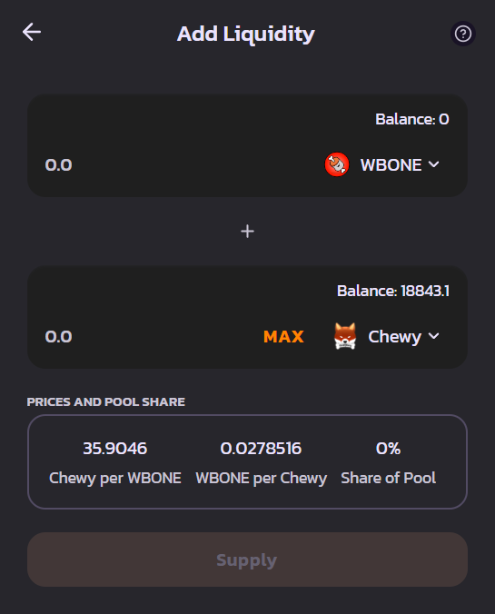

# 🔒 Liquidity Pools

Liquidity Pools are at the heart of a Decentralized Exchange's Automated Market Maker. Liquidity Pools are provided in the form of a DOG-20 token that represents the pairing of two tokens. The price of each token in the pair is determined by the ratio of tokens to one another.&#x20;

Lets say in theory you have a pool with 1000 "Example" tokens and 100 BONE. The price of 1 "Example" token will be 10 BONE each.

The first liquidity provider sets the price by setting the ratio of TokenA to TokenB. If you're creating a pool that doesn't yet exist on ChewySwap but exists on other AMM's it is recommended that you get the ratio correct or you may face losses if arbitrage trading bots use your pool to make a profit on the incorrect ratio.

<figure><figcaption>
Add Liquidity Card Example
</figcaption></figure>
