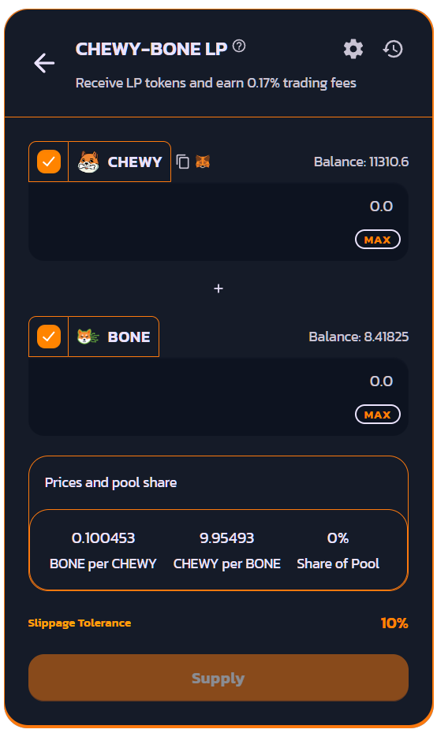

# 🔒 Liquidity Pools

### About Liquidity Pools

Liquidity Pools are at the heart of a Decentralized Exchange's Automated Market Maker. Liquidity Pools are provided in the form of a ERC-20 token that represents the pairing of two tokens. The price of each token in the pair is determined by the ratio of tokens to one another. These pairings make instant trading of one asset for another a possibility without the need for an order book like many centralized exchanges use.

Lets say in theory you have a pool with 1000 "Example" tokens and 100 BONE. The price of 1 "Example" token will be 10 BONE each.

The first liquidity provider sets the price by setting the ratio of TokenA to TokenB. If you're creating a pool that doesn't yet exist on ChewySwap but exists on other DEX it is recommended that you get the ratio correct or you may face impermanent loss if arbitrage trading bots use your pool to turn a profit on the incorrect ratio.

<figure><figcaption></figcaption></figure>

As an example, if you deposited **CHEWY** and **BONE** into a Liquidity Pool, you'd receive **CHEWY-BONE LP** tokens.

The number of LP tokens you receive represents your portion of the **CHEWY-BONE** Liquidity Pool.

You can also redeem your funds at any time by removing your liquidity.

### **Earning trading fees**

Whenever someone trades on ChewySwap, for each hop (swap) in each Exchange V2 liquidity pool, the trader pays a fixed 0.25% fee, **of which 0.17%** is added back to the Liquidity Pool in a form of trading fees.

### **Earning CHEWY**

To earn CHEWY for staking LP tokens on select pairs check out the [Farms section](https://farms.chewyswap.dog) of ChewySwap. For more information check the [Yield Farming section](../yield-farming/) of these docs.
