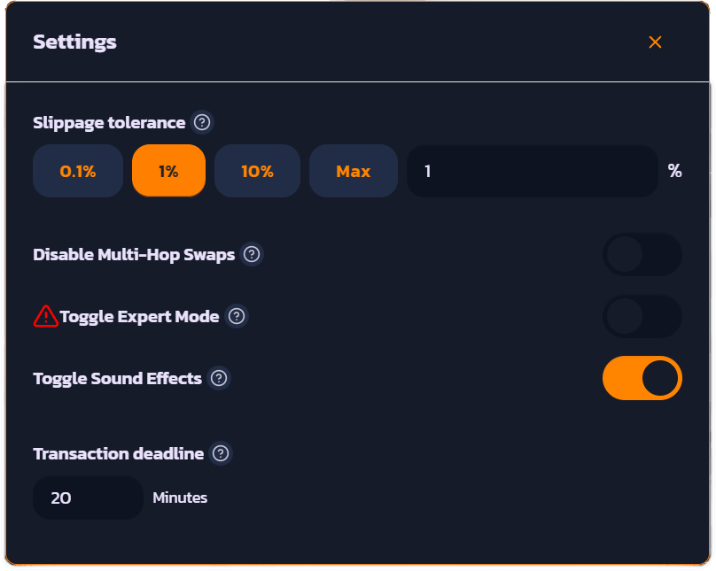

# ⚙ Settings / Slippage

At ChewySwap we put a lot of work into making sure our AMM interface is customizable to suit each user's preference and intended use. On the swap page there are various options that can be set by tapping the gear icon "⚙️".&#x20;


All user settings are automatically saved and will persist in your browser until either your browser cache is cleared or you change them back to their previous setting.


<figure><figcaption>
Settings Dialog. Tap or hover your mouse over the ❔ icon to get more information
</figcaption></figure>

## Slippage Tolerance

Whenever you make a trade there's always the possibility that the price can change between the time you press Swap and when your transaction gets confirmed. Slippage is a safety setting which ensures that the number of output tokens stays within the set tolerance indicated by "Slippage". This is useful in preventing your transaction from being frontrun or "sandwiched" which can happen if you set slippage too high.


For Example: Let's say you put in a swap trading 100 BONE for 1000 CHEWY and your Slippage is set at 1%, if someone makes a big buy or sell right before your swap and the difference in output tokens is +/- 1% of 1000 (less than 990 CHEWY or over 1010 CHEWY) then your transaction will Revert. In most cases for 0% tax tokens 1% slippage is OK unless the price is very volatile.&#x20;



\* This also applies for tokens that have a buy or sell tax, if the tax is > your Slippage then your transaction will most likely fail. Always set slippage to 1 or 2% higher than the token's Tax (refer to the particular project's website or TG community to find out the tax)



\*\* In certain cases where price is very volatile such as in a Fair Launch it may be necessary to set slippage higher than recommended. This is done at your own risk and there's a maximum slippage for normal mode. To disable safety checks on trades such as slippage/price impact turn on "Expert Mode" in Settings.


## Disable Multi-Hop Swaps

In some cases when the UI finds a better price by routing through different pairs it will route through those other pairs to achieve the swap. This is sometimes even necessary when there isn't a direct liquidity pair to trade for the given input and output tokens. The UI takes into account DEX fees in calculating this price.&#x20;

In some cases you might not want to use multi-hop, lets say for example there's a buy contest on POOSHIB token but only on the BONE pair and the swap is trying to route through the WETH pair - then you would want to disable Multi-Hops by turning the "Disable Multi-Hop Swaps" setting ON.

Note that disabling multi-hop swaps will persist through your next session and you'll need to turn the setting OFF again to enable Multi-Hop again.

## Toggle Expert Mode

ChewySwap is designed in a way to make trading on Decentralized Finance as safe as possible for the end user. There are multiple ways in which the UI tries to protect the user from themselves such as:

* Maximum Slippage
* Maximum Price Impact
* Confirm Dialogs which show the user the estimated output tokens according to slippage and price impact
* Confirm Dialogs which warn the user if the price impact is too high


Turning on Expert Mode **DISABLES all the above protections** and it must be understood that you could possibly **LOSE FUNDS** if you make a trade that has very high price impact! So only turn on Expert Mode if you're a seasoned expert in blockchain trading and fully understand this disclaimer! \
\
Swaps will go directly to transaction confirmation and will no longer show the dialogs or warnings for high price impact trades (up to a certain point).


Another feature of Expert Mode is the ability to add a send to your swap. This feature lets you make a swap and send the tokens to different wallet address from the one you're currently connected to. To enable this click the "+ Add a send (optional)" button and enter a _**valid**_ wallet address.

## Toggle Sound Effects

Does exactly what it says on the tin, enables or disables the Chewy sound effects when selecting tokens. Enabled turns sounds on, Disabled turns sounds off.

## Transaction Deadline

This setting rarely will ever need to be changed, this sets a transaction deadline for your swaps and LP add/remove transactions. If the transaction takes longer than the set number of minutes to be mined then it will automatically revert.&#x20;

In very rare cases your transactions will take longer than a couple minutes to be mined by validators, so only change if you know what you're doing.

